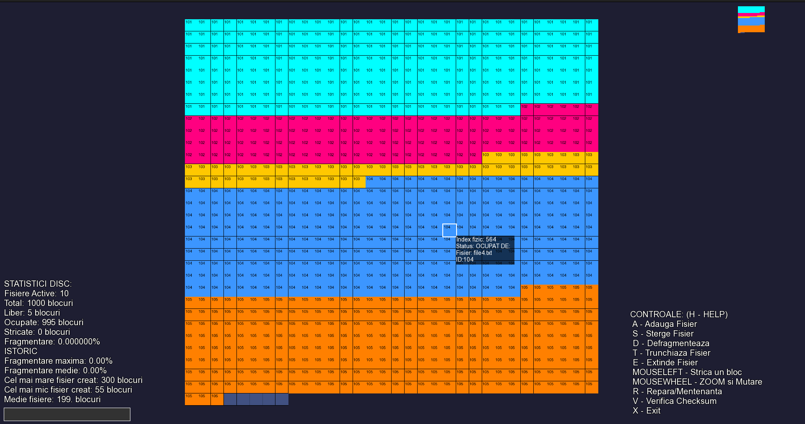

# Virtual Disk Space Manager & Defragmenter

This project visually simulates a file system, focusing on essential data management functions: creating, deleting, expanding, and truncating files.

The system integrates a checksum integrity verification mechanism capable of identifying corrupted data.

The application is fully interactive, allowing the user to manage the simulated disk through a Graphical User Interface (GUI). It provides real-time visual feedback on how different files (System, User, or Temp) are allocated, monitors the degree of disk fragmentation, and executes maintenance routines to optimize storage space.

## Colors and Meanings
* **DARK BLUE BLOCKS:** Free space (unallocated).
* **COLORED BLOCKS:** Active files. The color is generated based on the ID.
* **BLACK BLOCKS:** Bad blocks. Data cannot be written here.
* **BOTTOM BAR (Red/Yellow/Green):** Indicates the degree of disk fragmentation.



## Controls and Commands
* `[A]` **Add File:** Opens the creation window (ID -> Size -> Name).
    * *Names ending in '.sys' create SystemFiles, '.tmp' creates TempFiles. Anything else is treated as a UserFile.*
* `[S]` **Delete File:** Deletes a file by ID and frees up the blocks. (Except for System files)
* `[T]` **Trim:** Reduces the size of an existing file.
* `[E]` **Expand:** Increases the size of a file (may cause fragmentation).
* `[D]` **Defragment:** Starts the visual data defragmentation algorithm.
* `[R]` **Maintenance:** Deletes temporary files (.tmp) if the available space is below a certain percentage and moves the blocks of files from the damaged ones.
* `[V]` **Verify:** Runs Checksum to find errors (Feedback in console).
* `[LEFT CLICK]:` Marks a block as corrupted.
* `[SCROLL/MIDDLE CLICK]:` Zoom and navigate the disk map.

## Scenario
To observe the defragmentation algorithm, I propose the following scenario:
1. Create 3 files (without `.sys` in the name) of at least 150 blocks each with IDs in the form `xx1`, `xx2`, `xx3`.
2. Truncate the first and second files (with IDs `xx1` and `xx2`).
3. Press the `D` key and watch the statistics.

---

## Build Instructions

The project is configured using CMake.

**1. Configuration** Run the following command in your terminal to generate the build files:
```sh
cmake -S . -B build -DCMAKE_BUILD_TYPE=Debug
```
*For Windows users with GCC via Git Bash, use the Ninja generator:*
```sh
cmake -S . -B build -DCMAKE_BUILD_TYPE=Debug -G Ninja
```
*To configure with AddressSanitizer (ASan) on Linux/macOS:*
```sh
cmake -S . -B build -DCMAKE_BUILD_TYPE=Debug -DUSE_ASAN=ON
```

**2. Compilation** Compile the project using parallel jobs for faster build times:
```sh
cmake --build build --config Debug --parallel 6
```

**3. Installation (Optional)** ```sh
cmake --install build --config Debug --prefix install_dir
```

## Running the Application

You can run the executable directly from the build directory:
```sh
./build/oop
```
Or from the installation directory (if step 3 was executed):
```sh
./install_dir/bin/oop
```

**Memory Leak Testing (Valgrind)** To run the program with Valgrind (Linux/WSL), use the provided script:
```sh
./scripts/run_valgrind.sh
```
To run Valgrind in interactive mode:
```sh
RUN_INTERACTIVE=true ./scripts/run_valgrind.sh
```


